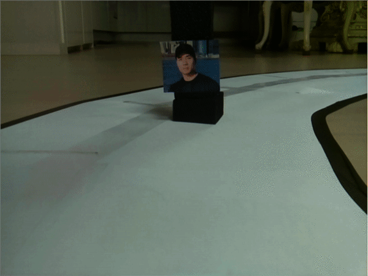

# Self_inform (version 0.5)
+ It is a program which is automatically informing wanted people if the camera is pointing their faces.  
+ It detects faces which are on the server.  

## The idea behind 
+ A number of people are missing or criminal nowdays so it is hard to find many people due to a small workforce.  
+ However, everyone who has a self-driving car can help to find people.  
+ The camera which is attached on the car will look faces during people driving so that it will be easier to find people.

## test

+ I've combined with my self-driving car which I made with a raspberry-pi before.  
+ [self-driving car](https://github.com/sammiee5311/raspberry_pi/tree/master/self_driving_car)

## How to use
+ Change to your email and password 'self.server.login('email', 'password')' on mail.py(42 line)
+ Change to from_email and to_email 'email_from = 'from_email'' 'email_to = ['to_email']' on mail.py(69,70 lines)
+ Change to image path and names that you want to find 'video_face_recog = video_face_recog.face_recog('./Images path', wanted_names=['name'])' on main.py(9 line)

## How it works
+ Dowload the csv file which includes people names and pictures from website(or server).  
+ Use raspberry pi, arduino or computer to initialize face-recognition in python.  
+ Put the people names and pictures in the list.  
+ It will look all faces through connected camera.  
+ Once the person who is in the list is appeared, that person is taken a picture and automatically sent the picture and the time to personal e-mail(gmail).

## Requirements
+ opencv-python
+ cmake
+ dlib
+ face-recognition
+ smtplib
+ BeautifulSoup
+ urllib
+ requests

### Refrence
+ https://github.com/ageitgey/face_recognition
+ https://youtu.be/sz25xxF_AVE
